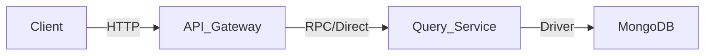
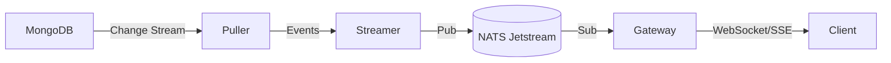

# Syntrix Architecture

Syntrix is a realtime backend-as-a-service platform designed for high scalability and low latency. It follows a microservices-oriented architecture where components can be deployed together (monolithic mode) or separately.

## System Overview

The system consists of the following core services:

1. **API Gateway**: The entry point for client REST requests. It handles authentication (future), validation, and routing to the Query Service.
2. **Query Service**: The central brain for data operations. It abstracts the storage layer and provides a unified interface for CRUD and complex queries.
3. **Realtime Service**: Manages persistent connections (WebSocket/SSE) with clients. It listens to change streams and pushes updates to subscribed clients.
4. **CSP (Change Stream Processor)**: A specialized service that connects to the database's change stream (e.g., MongoDB Change Streams) and fans out events to other services.
5. **Trigger Service**: A server-side event reaction system. It evaluates database changes against user-defined rules (CEL) and executes Webhooks via a durable queue (NATS).

## Arch Overview

- **Gateway** - The entrypoint of the service: Restful API, SSE, WebSocket.
- **QueryServer** - Expose Read/Write/Query capability.
- **Indexer** - Index Server, pull data from storage and build index, real worker of query request.
- **Puller** - Realtime change puller, subscribe changes from storage and fanout to consumers.
- **Streamer** - Realtime watch processor.
- **Trigger Evaluator** - Evaluator trigger rules from change stream.
- **Trigger Worker** - Webhook caller.

## Data Flow

### 1. Request Path (CRUD)

### 2. Realtime Path

### 3. Trigger Path

## Deployment Modes

Syntrix supports flexible deployment via the `Service Manager`:

- **Monolithic (Dev/Test)**: All services run in a single process.
- **Microservices (Prod)**: Services run in separate processes/containers, communicating via HTTP/RPC and NATS.

## Technology Stack

- **Language**: Go (Golang) 1.23+
- **Storage**: MongoDB (Primary Data Store)
- **Messaging**: NATS JetStream (Durable Queues for Triggers)
- **Realtime**: WebSocket / Server-Sent Events (SSE)
- **Logic Engine**: Google CEL (Common Expression Language)
