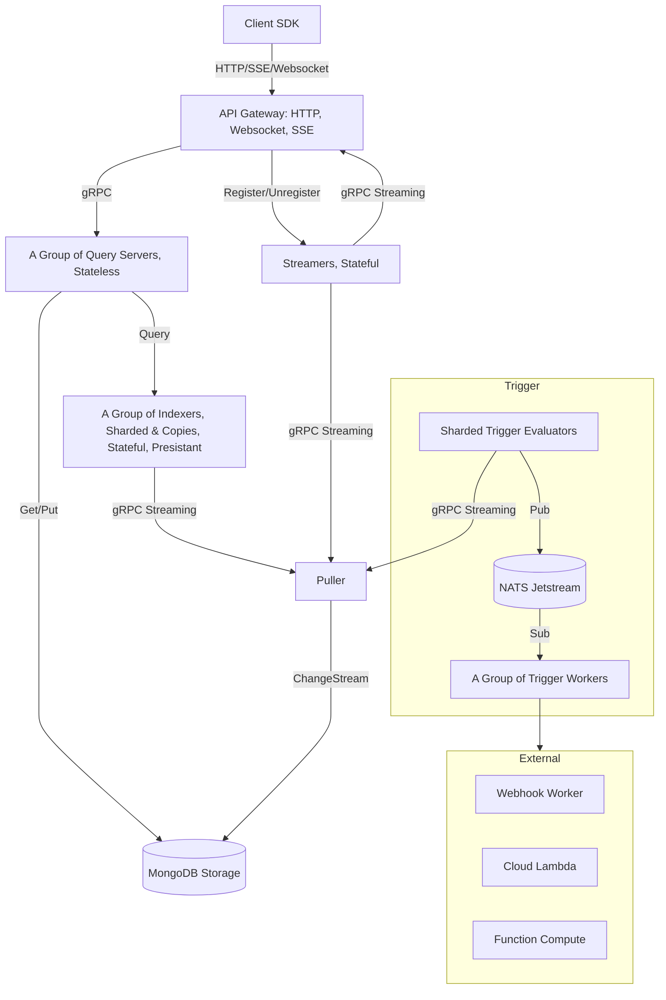

# Design Documents

This directory now splits designs into server-side and SDK-focused documents.

## Arch Overview

```mermaid
graph TB
    Client[Client SDK]
    Gateway[API Gateway: HTTP, Websocket, SSE]
    Streamer[Streamers, Stateful]
    Indexer[A Group of Indexers, Sharded & Copies, Stateful, Presistant]
    QueryServer[A Group of Query Servers, Stateless]
    MongoDB[(MongoDB Storage)]

    Client --> |HTTP/SSE/Websocket|Gateway

    Gateway ---> |gRPC| QueryServer ---> |Get/Put| MongoDB
    QueryServer ---> |Query| Indexer
    Indexer ---> |gRPC Streaming| Puller

    Gateway ---> |Register/Unregister|Streamer
    Streamer ---> |gRPC Streaming| Gateway
    Streamer ---> |gRPC Streaming| Puller

    Puller ---> |ChangeStream| MongoDB


    TriggerEval --->|gRPC Streaming| Puller
    TriggerEval ---> |Pub| NATS2 -->|Sub| TriggerWorker
    TriggerWorker --> External

    subgraph Trigger
        NATS2[(NATS Jetstream)]
        TriggerEval[Sharded Trigger Evaluators]
        TriggerWorker[A Group of Trigger Workers]
    end

    subgraph External
      Webhook[Webhook Worker]
      Lambda[Cloud Lambda]
      Function[Function Compute]
    end

```
