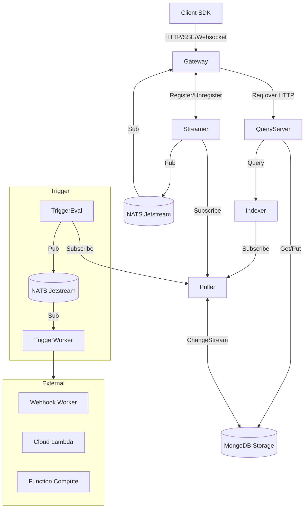

# Design Documents

This directory now splits designs into server-side and SDK-focused documents.

## Arch Overview

## Puller Event Schema

The Puller service emits events with the following characteristics:

- **Event Wrapper**: Events are wrapped in a `PullerEvent` structure containing the `change_event` and a `progress` marker.
- **Change Event**: The core event payload (`ChangeEvent`) reflects the MongoDB change stream event but with normalized fields.
- **Mongo Provenance**: Fields `mgoColl` and `mgoDocId` explicitly indicate the MongoDB collection and document ID (document key).
- **Full Document Contract**:
  - The `fullDoc` field MUST conform to the `storage.Document` JSON shape (containing `id`, `tenantId`, `fullpath`).
  - Update operations MUST use `UpdateLookup` to ensure `fullDoc` is present.
  - Events without `fullDoc` (except deletes) are rejected.
- **Tenant Identification**: Tenant ID is derived SOLELY from `fullDoc.TenantID`.
