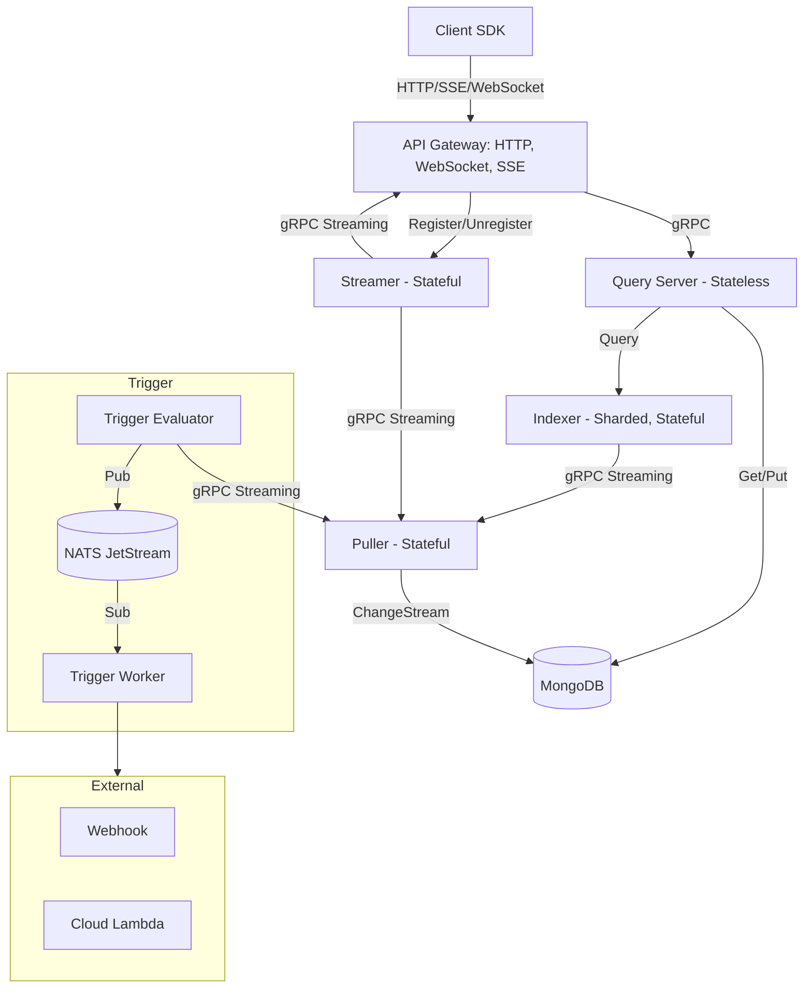

# Syntrix Server Architecture

**Last Updated:** January 2026

## 1. Overview

Syntrix is a Firestore-like realtime document database built with Go and MongoDB.

**Core Characteristics:**
- **Document-Collection Model**: Hierarchical structure (Collection → Document → Subcollection)
- **Realtime**: Push updates to clients via WebSocket/SSE
- **Splittable Monolith**: Run all services in one process (standalone) or as separate services (distributed)

## 2. Architecture Diagram



## 3. Core Services

| Service | Location | State | Description |
|---------|----------|-------|-------------|
| **Gateway** | `internal/gateway/` | Stateless | HTTP/WebSocket/SSE entry point, REST API, realtime connections |
| **Query** | `internal/query/` | Stateless | Query parsing, execution, CRUD operations |
| **Indexer** | `internal/indexer/` | Stateful | In-memory indexes, sharded, supports replicas |
| **Streamer** | `internal/streamer/` | Stateful | Manages realtime subscriptions, routes events to clients |
| **Puller** | `internal/puller/` | Stateful | Consumes MongoDB change streams, buffers events, distributes to consumers |
| **Trigger Evaluator** | `internal/trigger/evaluator/` | Stateful | Evaluates trigger conditions (CEL), publishes to NATS |
| **Trigger Worker** | `internal/trigger/delivery/` | Stateless | Consumes from NATS, delivers webhooks |

## 4. Supporting Components

| Component | Location | Description |
|-----------|----------|-------------|
| **Storage** | `internal/core/storage/` | MongoDB abstraction, document store interface |
| **Identity** | `internal/core/identity/` | Authentication (AuthN) and Authorization |
| **PubSub** | `internal/core/pubsub/` | NATS JetStream abstraction |
| **Server** | `internal/server/` | Unified gRPC server, service registration |
| **Services Manager** | `internal/services/` | Service lifecycle, dependency injection |

## 5. Deployment Modes

See [03.deployment_modes.md](03.deployment_modes.md) for details.

| Mode | Startup | Communication | Use Case |
|------|---------|---------------|----------|
| **Standalone** | `--standalone` | Direct function calls | Dev, Edge, Small deployments |
| **Distributed** | `--all`, `--query`, etc. | gRPC | Production at scale |

## 6. Data Flow

### 6.1 CRUD Operations

```
Client → Gateway (REST) → Query → Storage → MongoDB
```

### 6.2 Realtime Subscriptions

```
MongoDB ChangeStream → Puller → Streamer → Gateway → Client (WS/SSE)
```

### 6.3 Trigger Delivery

```
MongoDB ChangeStream → Puller → Trigger Evaluator → NATS → Trigger Worker → Webhook
```

## 7. Service Dependencies

```
                    ┌─────────┐
                    │ MongoDB │
                    └────┬────┘
                         │
                    ┌────▼────┐
                    │ Puller  │ ◄── Central event source
                    └────┬────┘
         ┌───────────────┼───────────────┐
         │               │               │
    ┌────▼────┐    ┌─────▼─────┐   ┌─────▼──────┐
    │ Indexer │    │ Streamer  │   │  Trigger   │
    └────┬────┘    └─────┬─────┘   │ Evaluator  │
         │               │         └─────┬──────┘
    ┌────▼────┐    ┌─────▼─────┐         │ NATS
    │  Query  │    │  Gateway  │   ┌─────▼──────┐
    └────┬────┘    │ (realtime)│   │  Trigger   │
         │         └─────┬─────┘   │  Worker    │
    ┌────▼────┐          │         └────────────┘
    │ Gateway │◄─────────┘
    │  (REST) │
    └─────────┘
```

## 8. Key Design Decisions

### 8.1 MongoDB as Storage Backend

- Native document model fits JSON-like structure
- Change Streams enable realtime subscriptions
- Atomic single-document operations with CAS

### 8.2 Puller as Central Event Source

All realtime consumers (Indexer, Streamer, Trigger) subscribe to Puller via gRPC streaming:
- **Durability**: Events buffered in PebbleDB
- **Replay**: Consumers can resume from checkpoint
- **Coalescing**: Multiple changes merged during catch-up

### 8.3 Push-All-Matching for Realtime

Server ignores `Limit`/`OrderBy` during streaming, pushes all matching documents:
- Stateless server (no per-subscription state)
- Client maintains sorted/limited view locally
- Works well with RxDB and similar offline-first clients

## 9. Component Design Docs

- [Deployment Modes](03.deployment_modes.md)
- [Indexer Architecture](indexer/01.architecture.md)
- [Puller Architecture](puller/01.architecture.md)
- [Streamer Architecture](streamer/01.architecture.md)
- [Trigger Architecture](trigger/01.architecture.md)
- [Identity Architecture](core/identity/01.architecture.md)
- [Storage Architecture](core/storage/01.architecture.md)
- [Gateway REST API](gateway/restful_api.md)
- [Gateway Realtime](gateway/realtime_watching.md)
