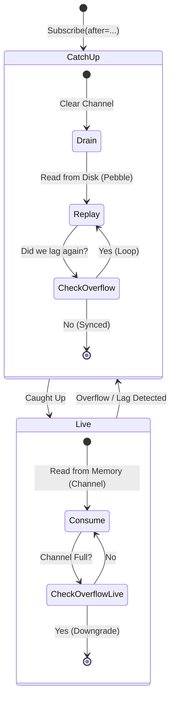

# Unified Adaptive Consumption Model

**Date:** January 1, 2026
**Status:** Implemented
**Component:** Puller Service (gRPC Layer)

## 1. Problem Statement

In a high-throughput streaming system, consumers (Subscribers) often face stability challenges:

1.  **Slow Consumers**: If a consumer cannot keep up with the ingestion rate (e.g., GC pauses, network latency, slow processing), the server-side buffer fills up.
2.  **Network Jitter**: Transient network spikes can cause temporary backpressure.
3.  **Traditional Solutions & Flaws**:
    *   **Unbounded Buffer**: Leads to OOM (Out of Memory) on the server.
    *   **Drop/Sample**: Unacceptable for a reliable CDC (Change Data Capture) system.
    *   **Fail-Fast (Disconnect)**: Forces the client to reconnect and restart from a checkpoint. This causes "Flapping" (connect -> lag -> disconnect -> reconnect -> lag...) and poor developer experience.

## 2. Solution: Adaptive Hybrid Consumption

We implemented a **Unified Adaptive Consumption Model** that treats "Initial Catch-up" and "Slow Consumer Downgrade" as the same problem. The system dynamically switches between two modes based on the consumer's health, without breaking the connection.

### 2.1 The Dual-Mode State Machine

The subscriber lifecycle is a loop that transitions between **Catch-up** and **Live** modes.



### 2.2 Modes Defined

#### Mode 1: Catch-up (Disk-based)
- **Source**: Persistent Buffer (PebbleDB).
- **Behavior**: High-throughput batch reading.
- **Trigger**:
    1.  New subscription with an old `after` cursor.
    2.  Live subscriber falls behind (Overflow).
- **Goal**: Replay history until the disk cursor catches up to the live window.

#### Mode 2: Live (Memory-based)
- **Source**: Go Channel (`chan *backendEvent`).
- **Behavior**: Low-latency real-time forwarding.
- **Trigger**: Catch-up phase completes successfully.
- **Constraint**: If the channel fills up (10,000 events), the system sets an `overflow` flag and downgrades back to Catch-up mode.

## 3. Implementation Details

### 3.1 Overflow Detection (Non-blocking)
Instead of disconnecting slow consumers, the `SubscriberManager` uses a non-blocking send with a fallback:

```go
select {
case sub.ch <- event:
    // Success
default:
    // Channel full: Mark as overflow, drop the event (it's safe on disk)
    sub.SetOverflow()
}
```

### 3.2 The Consumption Loop
The gRPC handler runs a continuous loop:

1.  **In Catch-up Mode**:
    *   **Drain**: Empty the `sub.ch` to discard stale real-time data (we will read it from disk anyway).
    *   **Replay**: Iterate from `CurrentProgress` using the storage engine.
    *   **Deduplication**: Use `ShouldSend(ClusterTime)` to ignore events that overlap with what was already sent.
    *   **Switch**: If `overflow` flag is set again during replay, repeat Catch-up. Otherwise, switch to Live.

2.  **In Live Mode**:
    *   **Consume**: Read from `sub.ch`.
    *   **Check Overflow**: Before processing, check `GetAndResetOverflow()`. If true, **Downgrade** immediately to Catch-up.
    *   **Deduplication**: Still required to handle the transition boundary (overlap between disk tail and memory head).

### 3.3 Buffer Sizing
The `sub.ch` size is increased to **10,000** (approx. 10MB per connection). This acts as a "Debounce" buffer to absorb transient network jitter (1-10 seconds) without triggering a mode switch.

## 4. Benefits

1.  **Always-On Connectivity**: Clients never receive "Disconnect" errors due to lag. The stream just slows down and catches up automatically.
2.  **Zero Data Loss**: The `CurrentProgress` cursor and `ShouldSend` deduplication ensure strict At-Least-Once delivery during mode switches.
3.  **Peak Shaving**: During traffic spikes, slow consumers automatically retreat to disk-based reading, protecting server memory.
4.  **Simplified Client Logic**: Clients don't need complex "Disconnect -> Backoff -> Reconnect" loops for handling backpressure.
