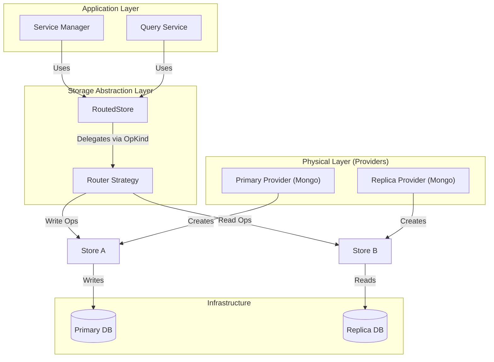

# Storage Architecture & Topology

## 1. Context & Problem

The initial storage decoupling (Task 003) introduced `Router` interfaces (`DocumentRouter`, `UserRouter`, etc.) to select stores based on operation type (`OpRead`, `OpWrite`).

However, the current implementation relies on the `Manager` to:
1. Initialize individual `Providers` (e.g., Mongo).
2. Extract `Stores` from them.
3. Inject them into a `Router`.

**Problem:** This leaks the storage topology into the application layer (`Manager`).
- If we want **Read/Write Splitting**, `Manager` needs to init two providers and wire them.
- If we want **Sharding**, `Manager` logic becomes complex.
- Configuration (`config.yaml`) should drive the topology, not hardcoded Go logic in `Manager`.

## 2. Architecture Overview

The storage layer is organized into a hierarchy of abstractions to separate **Topology** (how data is distributed) from **Implementation** (how data is stored) and **Consumption** (how data is used).

### 2.1. Core Concepts

1. **RoutedStore (The Facade)**
   - **Role**: The public entry point consumed by `Manager` and services (Query, Auth).
   - **Interface**: Implements standard `DocumentStore` / `UserStore`.
   - **Behavior**: Stateless wrapper. Delegates every call to a `Router` to select the target store, then executes the call.

2. **Router (The Brain)**
   - **Role**: Decides *which* underlying store handles a specific operation.
   - **Logic**: Based on `OpKind` (Read/Write/Migrate) or potentially data attributes (Sharding Key).
   - **Examples**: `SingleRouter` (Pass-through), `SplitRouter` (Read->Replica, Write->Primary).

3. **Store (The Worker)**
   - **Role**: The atomic unit of storage execution.
   - **Interface**: Same as `RoutedStore` (`DocumentStore`, etc.).
   - **Behavior**: Executes the actual DB operation. Does not know about routing.
   - **Examples**: `MongoDocumentStore`, `PostgresUserStore`.

4. **Provider (The Builder & Connection Holder)**
   - **Role**: The bridge between logical stores and physical infrastructure.
   - **Responsibility**:
     - **Connection Management**: Holds the actual DB client (e.g., `*mongo.Client`).
     - **Lifecycle**: Handles `Connect()` and `Close()` for the physical resource.
     - **Initialization**: Runs backend-specific setup like `EnsureIndexes` or schema migrations.
     - **Factory**: Produces `Store` instances bound to this specific connection.
   - **Scope**: One Provider = One Physical Backend (e.g., one Mongo Cluster connection).

5. **Factory / Stack (The Assembler)**
   - **Role**: The "God Object" of the storage layer initialization.
   - **Responsibility**: Reads config, initializes necessary Providers, creates the Router, wires Stores to Router, and returns the `RoutedStore`.

### 2.2. Architecture Diagram



### 2.3. Configuration Structure

The configuration drives the assembly process in the Factory.

```yaml
storage:
  document:
    routing:
      strategy: "read_write_split" # Strategies: single, read_write_split
    backends:
      primary:
        type: mongo
        uri: "mongodb://primary:27017"
        database: "syntrix_primary"
      replica:
        type: mongo
        uri: "mongodb://replica:27017"
        database: "syntrix_replica"
```

## 3. Detailed Design Questions

1. **Lifecycle Management**:
   - The `Factory` returns a `Closer` that aggregates the `Close()` calls for all initialized Providers.
   - `Manager` calls this single `Closer` on shutdown.

2. **Connection Sharing**:
   - If multiple logical stores (e.g., User and Revocation) use the same physical backend config, the Factory should ideally reuse the Provider instance to avoid double connections.
   - *Decision*: For V1, we can keep it simple (separate providers) or use a simple map `map[configHash]Provider` in the Factory to deduplicate.

3. **Dynamic Reconfiguration**:
   - Is this static at startup, or do we need hot-reloading?
   - *Decision*: Static at startup for now. Hot-reload requires a thread-safe Router swap mechanism.
```
