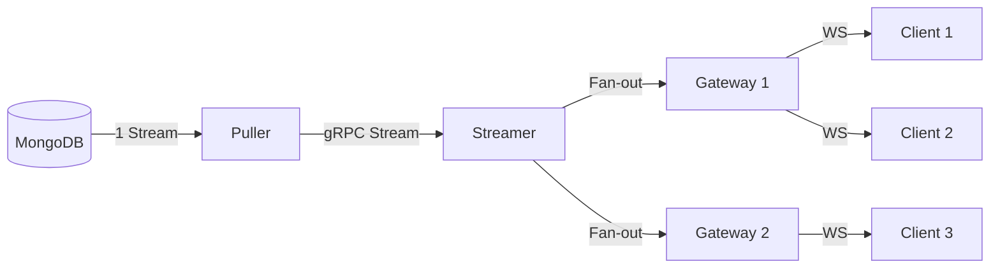

# Streamer Service Requirements

**Date:** January 3, 2026
**Status:** Accepted
**Component:** Streamer

## 1. Why Streamer? (Problem Statement)

Without a dedicated streaming service, the architecture faces critical bottlenecks when scaling real-time features:

### 1.1 Storage Overload (The "Fan-out" Problem)
If every Gateway node or client connects directly to MongoDB Change Streams:
- **Connection Explosion**: 1000 clients = 1000 change streams.
- **Resource Exhaustion**: MongoDB CPU/Memory spikes due to managing many cursors.
- **Unsustainable**: The database becomes the single point of failure and bottleneck.

### 1.2 Inefficient Matching
- **Duplicate Compute**: Every Gateway would need to run the same matching logic (e.g., "does this document match query X?").
- **Wasted Resources**: If 10 Gateways serve clients interested in the same data, they all process the same change event independently.

### 1.3 Coupling & Scalability
- **Stateful Gateways**: Gateways become heavy, managing both connections and complex matching logic.
- **Hard to Scale**: Scaling Gateways puts more pressure on the database (more change streams).

## 2. Core Concept: The "Streamer" Solution

The Streamer acts as a **centralized fan-out and matching engine**.

**Key Benefits:**
1.  **O(1) DB Load**: Regardless of client count, the DB sees constant load (via Puller).
2.  **Compute Efficiency**: Match an event *once*, route to *many* Gateways.
3.  **Separation of Concerns**: Gateways handle connections; Streamer handles data distribution.

## 3. Functional Requirements

### 3.1 Subscription Management
- **Registration**: Allow Gateways to register interest in specific queries (e.g., `collection="messages", chat_id="123"`).
- **Deregistration**: Remove subscriptions when clients disconnect.
- **TTL/Heartbeat**: Automatically expire stale subscriptions if a Gateway crashes.
- **State Strategy**: **Soft State**. Streamer keeps subscriptions in memory. On failure/restart, Gateways detect connection loss and re-register active subscriptions.

### 3.2 Event Ingestion
- **Source**: Consume normalized change events from the **Puller** service.
- **Format**: Handle standard event formats (Insert, Update, Delete, Replace).
- **Transformation**:
    - Translate "soft deletes" (e.g., updates setting `deleted=true`) into explicit `DELETE` events.
    - Translate "recreations" (e.g., updates setting `deleted=false`) into explicit `INSERT` events.

### 3.3 Event Matching
- **Query Matching**: Determine which subscriptions match a given change event.
- **Complex Queries**: Support basic equality (`chat_id=1`) and complex expressions via CEL (Common Expression Language).
- **Efficiency**: Match against 100k+ active subscriptions with low latency.

### 3.4 Routing & Delivery
- **Fan-out**: Send a single matched event to all Gateways holding relevant subscriptions.
- **Protocol**: Use efficient transport (gRPC) to communicate with Gateways.

## 4. Non-Functional Requirements

### 4.1 Performance
- **Latency**: End-to-end processing (Ingest -> Match -> Send) should be < 10ms (p99).
- **Throughput**: Capable of handling 10k+ events/sec per node.

### 4.2 Reliability
- **At-Least-Once Delivery**:
    - **Upstream (Puller -> Streamer)**: Streamer tracks the last processed `progress marker`. On restart or reconnection, it requests a replay from the Puller starting from this marker.
    - **Downstream (Streamer -> Gateway)**: gRPC streams ensure delivery. If a connection breaks, the Gateway must re-subscribe.
- **Fault Tolerance**: System should recover from Streamer or Gateway crashes without manual intervention.

### 4.3 Scalability
- **Horizontal Scaling**: Ability to add more Streamer nodes to handle increased event volume or subscription count.
- **Sharding**: Potential to shard by collection or hash if a single node is overwhelmed.

### 4.4 Ordering
- **Strict Per-Subscription Ordering**: Events matching a specific subscription MUST be delivered to the Gateway in the exact order they were received from the Puller.
- **Concurrency**: Parallel processing in Streamer must be partitioned (e.g., by `subscription_id` or `document_id`) to avoid race conditions.
