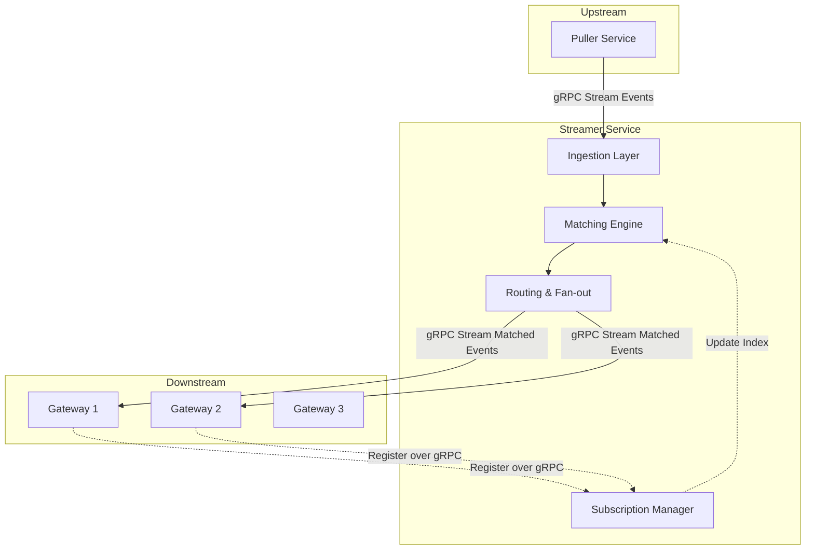

# Streamer Architecture

**Date:** January 3, 2026
**Status:** Design Draft
**Component:** Streamer Internal Architecture

## 1. Overview

The Streamer service is the high-throughput event matching and routing engine of Syntrix. It connects the storage layer (via Puller) to the connection layer (Gateway), ensuring that database changes are efficiently delivered to millions of connected clients.

## 2. High-Level Architecture



### 2.1 Key Design Decisions

#### Decision 1: Direct gRPC vs. Message Queue (NATS/Kafka)
**Decision**: **Direct gRPC Streaming**.
**Rationale**:
1.  **Complex Matching**: We require CEL-based expression matching (`age > 18`), which standard MQ topic routing cannot support efficiently.
2.  **Subscription Granularity**: We have millions of fine-grained subscriptions (e.g., specific document IDs). Mapping these to MQ topics would cause a "subscription explosion" and massive control plane overhead.
3.  **Latency**: Direct streaming removes an extra network hop and serialization cost.
4.  **Simplicity**: Streamer acts as a specialized, in-memory fan-out engine. Adding an external MQ adds operational complexity without solving the core matching problem.

#### Decision 2: Soft State Management
**Decision**: **In-Memory Subscriptions with Re-registration**.
**Rationale**:
1.  **Source of Truth**: Gateways own the client connections. They are the ultimate source of truth for who needs what data.
2.  **Resilience**: If Streamer crashes, it restarts empty. Gateways detect the break and re-send their subscriptions. This self-heals and naturally cleans up stale state.
3.  **Performance**: No database or Redis round-trips for subscription checks.

## 3. Component Design

### 3.1 Ingestion Layer
*   **Role**: Receives normalized events from Puller.
*   **Protocol**: gRPC Server Streaming.
*   **Responsibility**:
    *   Deserialization.
    *   **Soft Delete Transformation**: Converts `deleted=true` updates into `DELETE` events.
    *   **Recreation Handling**: Converts updates that revert a soft delete (e.g., `deleted=false`) into `INSERT` events.
    *   **Ordering**: Preserves the order of events received from Puller.

### 3.2 Subscription Manager
*   **Role**: Manages the registry of active subscriptions from Gateways.
*   **Data Structure**:
    *   **Trie / Inverted Index**: For fast lookup of equality matches (e.g., `collection="users", id="123"`).
    *   **Expression List**: For complex CEL queries, potentially optimized with a pre-filter (e.g., Bloom Filter or Bitset) to reduce evaluation cost.
*   **Lifecycle**: Handles `Subscribe`, `Unsubscribe`, and `Heartbeat` signals from Gateways.

### 3.3 Matching Engine
*   **Role**: The CPU-intensive core. Matches an incoming event against the Subscription Index.
*   **Process**:
    1.  **Fast Path**: Lookup by Collection + Document ID (O(1) or O(log N)).
    2.  **Slow Path**: Evaluate CEL expressions for broad queries (e.g., `collection="msgs", room_id="A", type="text"`).
*   **Output**: A list of `(GatewayID, SubscriptionID)` tuples.

### 3.4 Routing & Fan-out
*   **Role**: Groups matched subscriptions by Gateway and sends events.
*   **Mechanism**:
    *   Maintains a map of `GatewayID -> gRPC Stream`.
    *   **Batching**: (Optional) Small micro-batching (<1ms) to reduce syscalls if throughput is extreme.
    *   **Backpressure**: Monitors gRPC stream health. If a Gateway is slow, we must decide to drop or buffer (current preference: buffer with limit, then drop/disconnect).

## 4. Data Flow

### 4.1 Data Flow Architecture

The Streamer supports two deployment modes with a unified internal model:

```
┌─────────────────────────────────────────────────────────────────────────┐
│                           streamerService                               │
│                                                                         │
│   Puller ──► ProcessEvent() ──► Manager.Match() ──► streams map         │
│                                                            │            │
│                                               ┌────────────┴──────────┐ │
│                                               ▼                       ▼ │
│                                          localStream             localStream
│                                          (in-process)        (wrapped by adapter)
└─────────────────────────────────────────────────────────────────────────┘
                                               │                       │
                                               ▼                       ▼
                                          [Gateway]            grpcStreamAdapter
                                          (in-process)                 │
                                                                       ▼
                                                                  gRPC Server
                                                                       │
                                                                  ~~~GRPC~~~
                                                                       │
                                                                       ▼
                                                                Stream Client
                                                                       │
                                                                       ▼
                                                                  [Consumer]
```

**Distributed Mode:**
```
Puller → streamerService → localStream → grpcStreamAdapter → gRPC Server → [GRPC] → Stream Client → [Consumer]
```

**In-Process Mode:**
```
Puller → streamerService → localStream → [Consumer]
```

Key insight: **localStream is the unified internal abstraction**. In distributed mode, `grpcStreamAdapter` wraps localStream and handles protocol conversion between localStream and gRPC.

### 4.2 Event Processing Steps

1.  **Setup**: Gateway connects to Streamer and sends `Subscribe(Query: "chat_id=1")`. Streamer adds this to its Index.
2.  **Ingest**: Puller sends `Event{ID: 100, Data: {chat_id: 1, text: "hi"}}`.
3.  **Match**: Engine sees `chat_id: 1` in event, looks up Index, finds Gateway A is interested.
4.  **Route**: Streamer sends `Event{ID: 100}` to Gateway A via established gRPC stream.
5.  **Ack**: (Optional) Streamer updates its progress marker after successful routing.

## 5. Scalability & Partitioning

*   **Partitioning Strategy**: Streamer nodes are stateless (soft state).
*   **Sharding**:
    *   **By Collection**: Different Streamers handle different collections.
    *   **By Hash**: Puller can hash `DocumentID` and send to different Streamer nodes.
    *   Gateways must connect to **all** Streamer nodes (or a subset based on the same sharding logic) to ensure they receive all relevant events.
