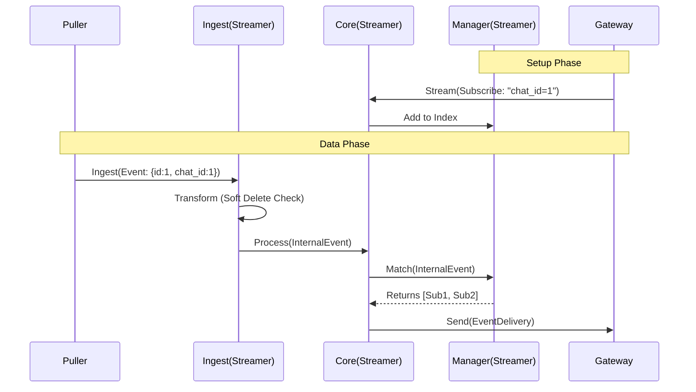

# Streamer Overall Design

**Date:** January 3, 2026
**Status:** Design Draft
**Component:** Streamer

## 1. Service Interfaces (API)

The Streamer exposes one main gRPC service for serving Gateways. For ingestion, it acts as a client to the upstream Puller service.

### 1.1 Ingestion (Upstream Client)

Streamer acts as a client to the upstream Puller service using the provided Go client SDK.

*   **Package**: `github.com/syntrixbase/syntrix/internal/puller`
*   **Interface**: `puller.Service`
*   **Method**: `Subscribe(ctx, consumerID, after) -> <-chan *puller.Event`
*   **Behavior**:
    *   On startup, Streamer initializes `puller.NewClient`.
    *   Calls `Subscribe` with the last processed `progress` marker (if any).
    *   Consumes the returned channel of `*puller.Event`.

### 1.2 Gateway API (Downstream)

Used by **Gateway** nodes to manage subscriptions and receive matched events. We use a **Bidirectional Streaming** RPC to handle both control signals (Subscribe/Unsubscribe) and data delivery (Events) over a single persistent connection.

```protobuf
service StreamerService {
  // Bi-directional stream:
  // - Gateway sends: Subscriptions, Heartbeats
  // - Streamer sends: Matched Events
  rpc Stream(stream GatewayMessage) returns (stream StreamerMessage);
}

message GatewayMessage {
  oneof payload {
    SubscribeRequest subscribe = 1;
    UnsubscribeRequest unsubscribe = 2;
    Heartbeat heartbeat = 3;
  }
}

message StreamerMessage {
  oneof payload {
    EventDelivery delivery = 1;
    HeartbeatAck heartbeat_ack = 2;
  }
}

message SubscribeRequest {
  string subscription_id = 1; // Generated by Gateway
  string collection = 2;

  // Matching criteria
  repeated Filter filters = 3; // Structured filter
}

message Filter {
  string field = 1;
  string op = 2; // e.g., "==", ">", "in"
  Value value = 3;
}

message Value {
  oneof kind {
    string string_value = 1;
    int64 int_value = 2;
    double double_value = 3;
    bool bool_value = 4;
    ListValue list_value = 5;
  }
}

message ListValue {
  repeated Value values = 1;
}

message EventDelivery {
  Event event = 1;
  repeated string subscription_ids = 2; // Which subscriptions matched this event
}
```

## 2. Core Data Structures

### 2.1 Subscription Index (`manager`)

The heart of the Streamer is the in-memory index that maps criteria to Gateway connections.

```go
type SubscriptionManager struct {
    // Fast Path: Collection -> DocID -> List of Subscribers
    exactMatches map[string]map[string][]*Subscriber

    // Slow Path: Collection -> List of CEL Expressions
    expressions map[string][]*ExpressionSubscriber

    // Reverse Index: GatewayID -> List of SubscriptionIDs (for cleanup)
    gatewaySubs map[string]map[string]struct{}
}

type Subscriber struct {
    GatewayID      string
    SubscriptionID string
    Stream         grpc.ServerStream
}

type ExpressionSubscriber struct {
    Subscriber
    Program cel.Program // Compiled CEL program
}
```

### 2.2 Internal Event (`model`)

```go
type InternalEvent struct {
    Collection string
    Op         OperationType // Insert, Update, Delete
    DocID      string
    Data       map[string]interface{} // Decoded payload for CEL evaluation
    Raw        []byte                 // Original payload for forwarding
}
```

## 3. Module Breakdown

### 3.1 `internal/streamer`
The Streamer follows the standard Syntrix module pattern, exposing a public `Service` interface and providing both local and remote implementations.

*   **Interface Definition**: `internal/streamer/interface.go`
*   **Public API**:
    ```go
    type Service interface {
        // Stream establishes a bidirectional stream for subscriptions and events.
        // Used by Gateway to register interest and receive updates.
        Stream(ctx context.Context) (Stream, error)
    }

    type Stream interface {
        Send(*GatewayMessage) error
        Recv() (*StreamerMessage, error)
        CloseSend() error
    }
    ```
*   **Implementations**:
    *   `NewService(cfg, logger)`: Creates the local service implementation (delegates to `internal/streamer/internal/core`).
    *   `NewClient(addr, logger)`: Creates a gRPC client that connects to a remote Streamer service (delegates to `internal/streamer/internal/client`).

### 3.2 `internal/streamer/internal/core`
*   **Responsibility**: The main entry point for the local Streamer service.
*   **Logic**:
    *   Initializes `Manager` and `Ingest`.
    *   Implements the `Service` interface.
    *   **Event Loop**:
        *   Receives events from `Ingest`.
        *   Calls `Manager.Match(event)` to get subscribers.
        *   Dispatches events to the appropriate `grpc.ServerStream`.

### 3.3 `internal/streamer/internal/client`
*   **Responsibility**: The remote client implementation.
*   **Logic**:
    *   Implements the `Service` interface.
    *   Connects to a remote Streamer via gRPC.
    *   Translates method calls into gRPC messages.

### 3.4 `internal/streamer/internal/ingest`
*   **Responsibility**: Implements `IngestionService`.
*   **Logic**:
    *   Receives `IngestRequest`.
    *   Performs **Transformation** (Soft Delete -> Delete, Recreate -> Insert).
    *   Decodes payload (if needed for CEL).
    *   Passes `InternalEvent` to the `Engine`.

### 3.5 `internal/streamer/internal/manager`
*   **Responsibility**: Manages the `SubscriptionIndex` and performs event matching.
*   **Logic**:
    *   **Index Management**: Thread-safe `AddSubscription` / `RemoveSubscription`.
    *   **Matching Engine**:
        *   **Step 1 (Exact Match)**: Look up `exactMatches[evt.Collection][evt.DocID]`.
        *   **Step 2 (Expression Match)**: Iterate through `expressions[evt.Collection]`, execute CEL against `evt.Data`.
        *   **Step 3 (Result)**: Return aggregated list of matching `Subscriber` objects.
    *   **Cleanup**: Handles Gateway disconnects.

### 3.6 `internal/streamer/internal/grpc`
*   **Responsibility**: Implements the gRPC server and handles Gateway connections.
*   **Logic**:
    *   Implements `StreamerService` gRPC interface.
    *   Maintains the active `grpc.ServerStream` for each Gateway.
    *   Receives routed events from `Engine` and sends `StreamerMessage`.
    *   Handles flow control (buffering/dropping if Gateway is slow).

## 4. Sequence Diagram (Life of an Event)


